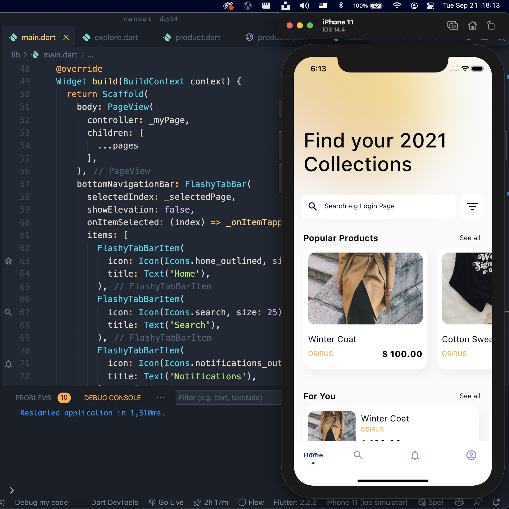
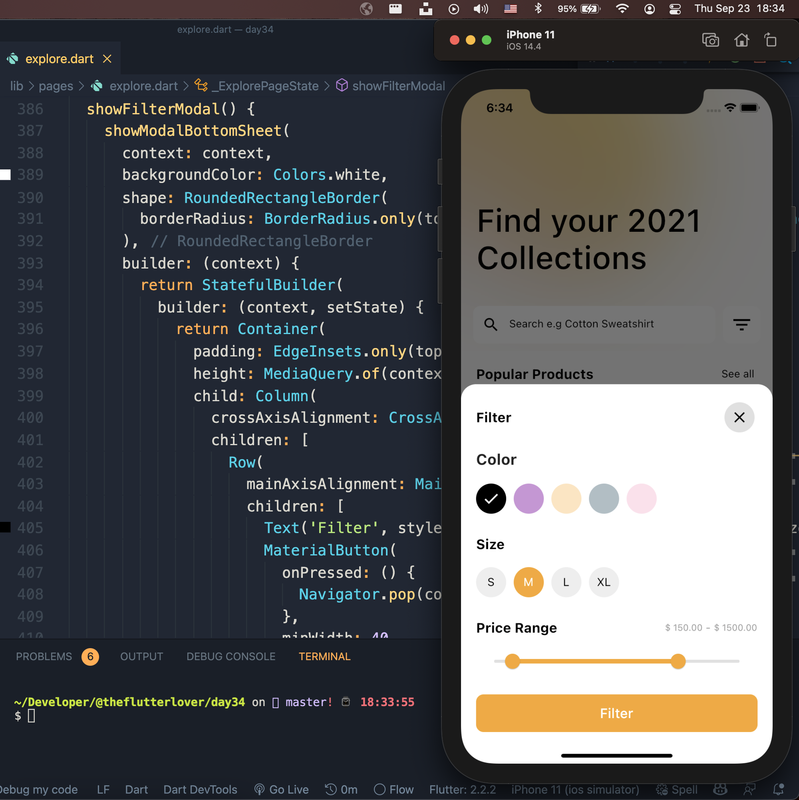
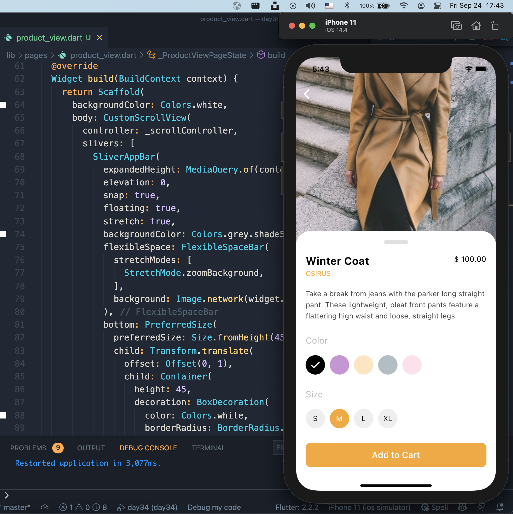
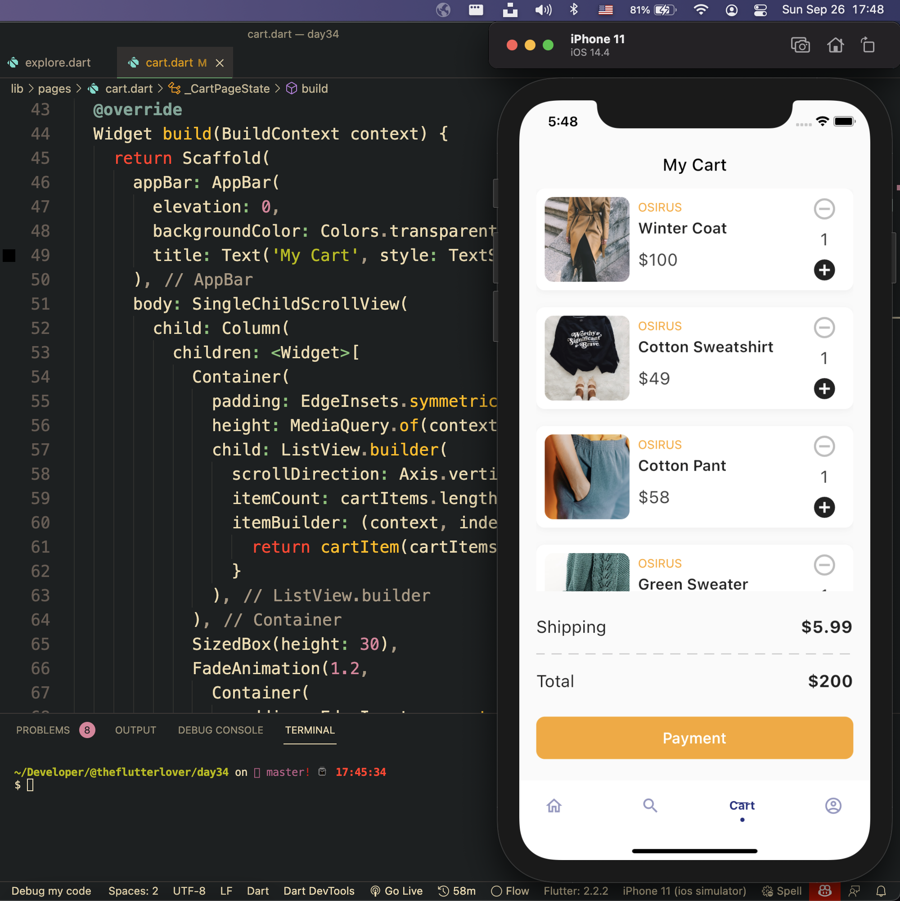
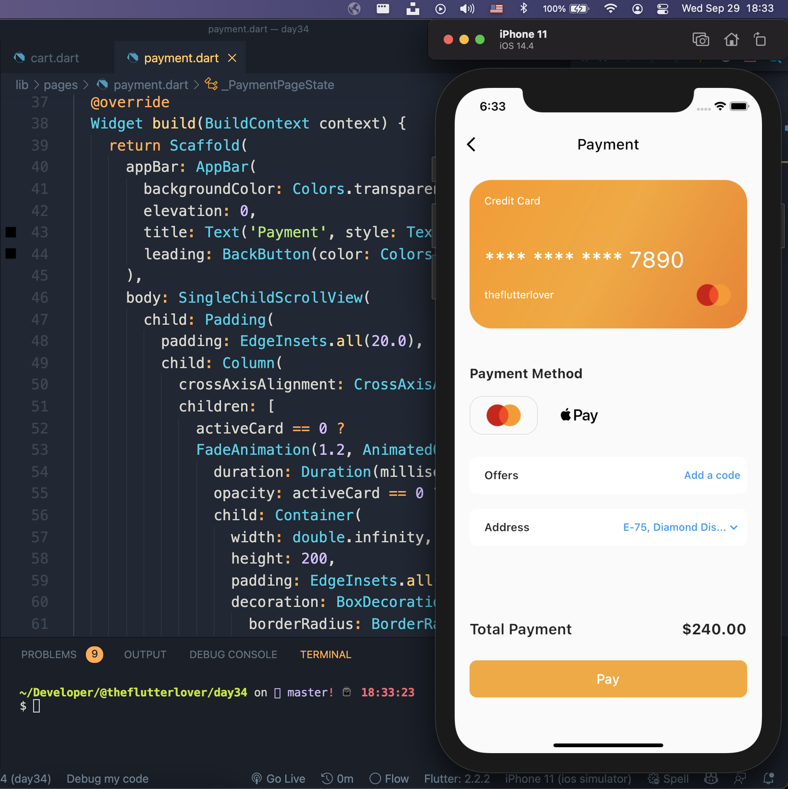

## Flutter e-commerce Application 


Assets 
* [Unsplash](https://unsplash.com)
* [icon8](https://icons8.com)


## Development Setup
Clone the repository and run the following commands:
```
flutter pub get
flutter run
```

## Screenshot
### Home Page


### Filter Modal


### Product View


### Cart Page


### Payment Page



